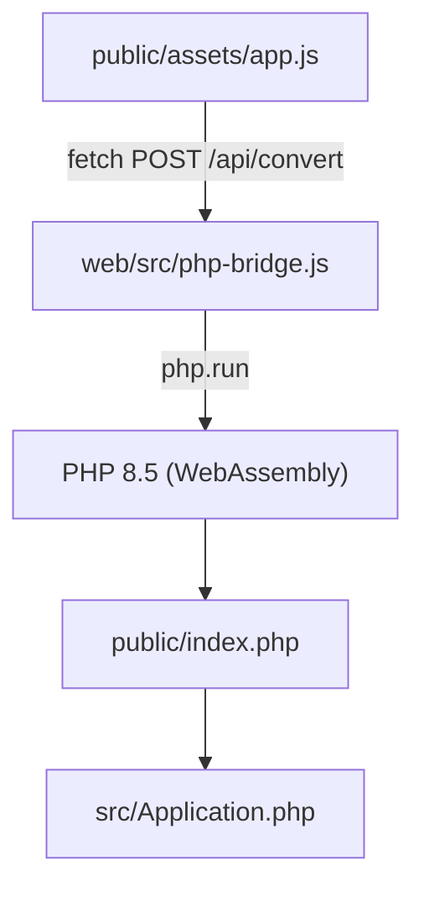

# Web版（ブラウザ内PHP）

## 概要

Web版は、WebAssembly版のPHP（[`@php-wasm/web`](https://www.npmjs.com/package/@php-wasm/web)）をブラウザ内で動かし、単体バイナリ版と同じ `src/` と `public/index.php` で変換します。

PHPのサーバーを持たない静的サイトなので、Cloudflare Workers（静的アセット）やCloudflare Pagesなどの静的ホスティングに置けます。入力はブラウザの外へ送られません。

変換はPHPの `token_get_all()` による字句解析をそのまま使うため、単体バイナリ版と同じ結果になります。

## 仕組み



- `web/src/php-bridge.js` は起動時に `src/**/*.php` と `public/index.php` をWebAssembly版PHPのファイルシステムへ書き込みます
- Composerの `vendor/autoload.php` の代わりに、`src/` だけを読むPSR-4オートローダーを置きます
- `/api/convert` への `fetch` だけを横取りし、WebAssembly版PHPで `public/index.php` を実行したレスポンスを返します。`public/assets/app.js` は単体バイナリ版と共通です
- WebAssembly版PHPを読み込むまでは変換ボタンを無効にします

## ビルド

`web/vite.config.js` は `public/` をルートにしてビルドし、`public/index.html` に `web/src/php-bridge.js` を差し込みます。

```bash
cd web
npm ci
npm run build
```

`web/dist` に静的ファイルが出力されます。

開発サーバーは以下で起動します。

```bash
npm run dev
```

## サイズ

- WebAssembly版PHPは1ファイル約21MB（gzip後約8MB）です。JSPI版とAsyncify版の2つを同梱し、ブラウザはどちらか一方だけを読み込みます
- Cloudflareの静的アセットは1ファイル25MiBまでです。使わないPHPバージョンと、`intl` 拡張のICUデータ（約30MB）はビルドで同梱しません
- `web/static/_headers` で、ハッシュ付きファイル名の `/assets/*` を長期キャッシュします

## デプロイ

`web/wrangler.jsonc` はCloudflare Workersの静的アセットとして `web/dist` を配信する設定です。`https://php-array-json-converter.orukubami.sh` をカスタムドメインとして割り当てます。DNSレコードと証明書はデプロイ時にCloudflareが作成します。

```bash
cd web
npm ci
npx wrangler login
npm run deploy
```

カスタムドメインを使うには、ドメインのDNSがデプロイ先と同じCloudflareアカウントで管理されている必要があります。

Cloudflare PagesのGit連携を使う場合は、ビルド設定を以下にします。

```text
Root directory:         web
Build command:          npm ci && npm run build
Build output directory: dist
```

## 対応バージョン

- PHP: 8.5（`web/src/php-bridge.js` の `PHP_VERSION` と `web/vite.config.js` の `PHP_PACKAGE_VERSION` をそろえる）
- `@php-wasm/web` / `@php-wasm/universal`: `web/package.json` で固定
